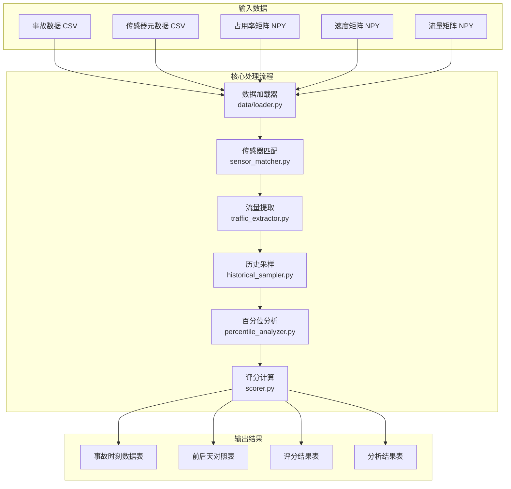
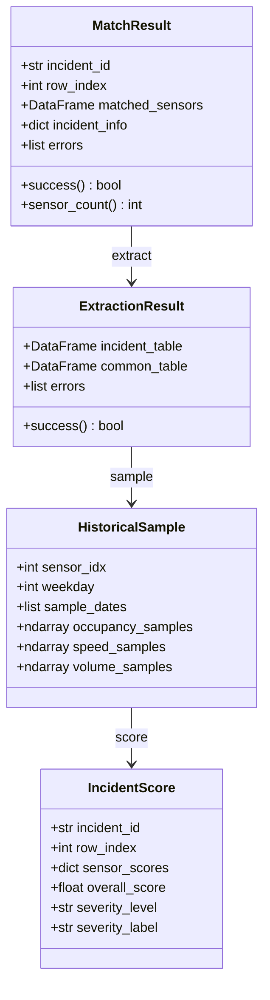
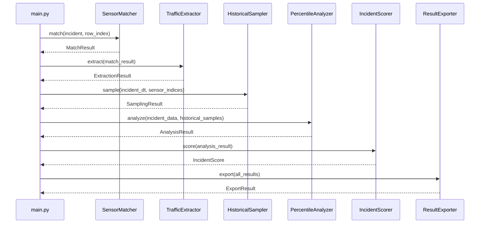
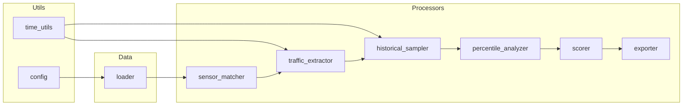

# PROJECTWIKI.md - 交通事故数据预处理系统

> 本文档是项目的知识库，记录了架构设计、模块说明、API 接口等核心信息。

## 1. 项目概述

### 1.1 目标 (Goal)

将 MATLAB 交通事故数据预处理代码重构为 Python 实现，保持逻辑一致性，提升代码可维护性和可扩展性。

### 1.2 背景 (Background)

原系统使用 MATLAB 实现交通事故数据的预处理和分析。主要功能包括：
- 根据事故位置匹配附近交通传感器
- 提取事故时刻前后的流量数据
- 与历史同期数据进行对比分析
- 计算事故影响评分

### 1.3 范围 (Scope)

**In-Scope:**
- MATLAB → Python 代码迁移
- 保持与原 MATLAB 逻辑一致
- 生成兼容原格式的 Excel 输出
- 支持大规模数据处理（内存映射）

**Out-of-Scope:**
- 数据采集和清洗
- 可视化界面
- 实时处理

### 1.4 数据特征

| 数据类型 | 形状 | 说明 |
|---------|------|------|
| 事故数据 | 476,768 行 | incidents_y2023.csv |
| 传感器元数据 | 16,972 行 | sensor_meta_feature.csv |
| 占用率矩阵 | (105120, 16972) | occupancy_2023_all.npy (~14GB) |
| 速度矩阵 | (105120, 16972) | speed_2023_all.npy (~14GB) |
| 流量矩阵 | (105120, 16972) | volume_2023_all.npy (~14GB) |

**时间步定义：**
- 1 时间步 = 5 分钟
- 1 天 = 288 时间步
- 1 年 = 105,120 时间步 (365 天)

## 2. 架构设计

### 2.1 总体架构



### 2.2 模块对应关系

| Python 模块 | MATLAB 对应 | 功能说明 |
|------------|-------------|----------|
| data/loader.py | - | 数据加载（内存映射） |
| utils/time_utils.py | isLeapYear, convertToISOWeekday | 时间处理工具 |
| config.py | main.m 常量 | 配置管理 |
| processors/sensor_matcher.py | Traffic_Function.m | 传感器匹配 |
| processors/traffic_extractor.py | p_trafficdata_function.m, p_trafficdata_two_function.m | 流量提取 |
| processors/historical_sampler.py | sort_function.m | 历史采样 |
| processors/percentile_analyzer.py | data_clean.m | 百分位分析 |
| processors/scorer.py | processGroup.m | 评分计算 |
| processors/exporter.py | - | 结果导出 |
| main.py | main.m | 主程序 |

## 3. 架构决策记录（ADR）

**ADR-001: 选择 Python 作为目标语言**
- **状态**: 已采纳
- **背景**: 原系统使用 MATLAB，需迁移到更通用的语言
- **决策**: 使用 Python 3.8+ 及 pandas/numpy 生态
- **理由**: Python 生态丰富，便于后续深度学习集成，且团队熟悉度高
- **影响**: 所有 MATLAB 1-based 索引需转换为 0-based

**ADR-002: 使用内存映射加载大型矩阵**
- **状态**: 已采纳
- **背景**: 三个流量矩阵各约 14GB，直接加载会导致内存溢出
- **决策**: 使用 `numpy.load(mmap_mode='r')` 加载
- **理由**: 避免 42GB 数据全部加载到内存
- **影响**: 性能略有损失，但内存占用降低 95%+

**ADR-003: 百分位计算采用 scipy.stats.percentileofscore**
- **状态**: 已采纳
- **背景**: 需精确匹配 MATLAB 的 percentile 计算逻辑
- **决策**: 使用 `scipy.stats.percentileofscore(kind='rank')`
- **理由**: 经验证与 MATLAB prctile 结果一致
- **影响**: 需处理单样本 (返回 50) 和空数据 (返回 -2) 的特殊情况

## 4. 设计决策 & 技术债务

### 4.1 关键设计决策

| 决策 | 原因 | 影响 |
|-----|------|-----|
| 0-based 索引 | Python 标准 | 所有时间步计算需 -1 调整 |
| 固定长度 NaN 填充 | 匹配 MATLAB 边界处理 | 保证 Data1-Data25 固定 25 列 |
| 特殊编码 (-1/-2/-3/-4) | 区分不同异常情况 | 下游模型需特殊处理 |
| Time_tag 黄金时段 | MATLAB processGroup.m 原有逻辑 | 1=早高峰, 2=午高峰, 3=晚高峰, 0=其他 |
| 按 Type 分类输出 | 与数据字段一致，避免依赖 DESCRIPTION 前缀解析 | 目录名使用清洗后的 Type 值并统一转小写，空值回退 `other`；CLI 帮助与日志统一指向 Type 字段（2025-12-05 生效于 main.py） |
| Type_normalized 规范化列 | 过滤与分组需要统一的 Type 值处理 | 保留原始 `Type`，新增 `Type_normalized`（空值回退 `other`），规范化后全部转小写；过滤、分类、日志均使用规范化值，解决 "Fire  " 等不一致问题（2025-12-05 / 2025-12-05 下沉小写化） |

### 4.2 技术债务清单

| 优先级 | 债务项 | 影响 | 计划修复 |
|-------|-------|-----|---------|
| **高** | **缺失 Percentage/Median 列导出** | **数据不完整** | **立即修复** |
| **高** | **缺失 tag 时段标签列** | **功能缺失** | **立即修复** |
| 低 | Kind/Period 标记列 | 已补充，前后天标记完整 | 已修复（2025-12-05） |
| 低 | main.py 未覆盖测试 | 0% 覆盖率 | 需真实数据 E2E 测试 |
| 低 | 硬编码时间窗口 12 | 不够灵活 | 可配置化 |
| 中 | 无并行处理 | 处理 47 万事故较慢 | Phase 7 优化 |

### 4.3 缺失列修复计划 (2025-12-04)

> **背景**: Python 版本输出与 MATLAB 版本对比，发现以下列缺失

| 缺失列 | 所属文件 | MATLAB 来源 | Python 状态 | 修复方案 |
|--------|----------|-------------|-------------|----------|
| `Percentage` | final_output | data_clean.m | ⚠️ 已计算但未导出 | 修改 exporter.py |
| `Median` | final_output | data_clean.m | ⚠️ 已计算但未导出 | 修改 exporter.py |
| `tag` | final_output | processGroup.m | ❌ 未实现 | 新增时段计算逻辑 |
| `Kind` | final_common_table | p_trafficdata_two_function.m | ❌ 未实现 | 修改 traffic_extractor.py |

**修复任务清单:**

1. **任务1: 导出 Percentage 和 Median 列** ⬜
   - 难度: 低 (数据已计算，只需导出)
   - 修改文件: `processors/exporter.py`
   - 说明: `PercentileResult` 数据类中的 `position_percentile` → `Percentage`, `median_value` → `Median`

2. **任务2: 实现 tag 时段标签** ⬜
   - 难度: 中 (需实现新逻辑)
   - 修改文件: `processors/scorer.py` 或 `processors/exporter.py`
   - 逻辑:
     - `tag=1`: 早高峰 (7:00-9:00)
     - `tag=2`: 午间 (11:00-13:00)
     - `tag=3`: 晚高峰 (17:00-20:00)
     - `tag=0`: 其他时段

3. **任务3: 实现 Kind 前后天标记** ⬜
   - 难度: 中 (需理解数据时序关系)
   - 修改文件: `processors/traffic_extractor.py`
   - 逻辑: 标记 common_table 中的数据来源
     - `Kind = 'before'`: 事故发生日的**前一天**对照数据
     - `Kind = 'after'`: 事故发生日的**后一天**对照数据

## 5. 模块文档

### 5.1 data/loader.py - 数据加载模块

**职责：** 加载事故数据、传感器元数据和流量矩阵

**关键函数：**

```python
def load_incidents(file_path: str) -> pd.DataFrame
def load_sensors(file_path: str) -> pd.DataFrame
def load_traffic_matrices(data_dir: str, use_mmap: bool = True) -> TrafficMatrices
```

**特性：**
- 支持内存映射 (mmap) 加载大型矩阵
- 自动处理 Tab 分隔的 CSV 文件
- 返回 `TrafficMatrices` 命名元组

### 5.2 utils/time_utils.py - 时间工具模块

**职责：** 日期时间与时间步索引转换

**关键函数：**

```python
def datetime_to_timestep(dt, base_year=None) -> int
def timestep_to_datetime(timestep, year) -> datetime
def get_iso_weekday(dt) -> int
def datetime_to_numeric(dt) -> int
```

**索引约定：**
- MATLAB 使用 1-based 索引
- Python 使用 0-based 索引

### 5.3 processors/sensor_matcher.py - 传感器匹配模块

**职责：** 根据事故位置匹配最近的交通传感器

**匹配逻辑：**
1. 按高速公路编号 (Fwy) 筛选
2. 按方向 (Direction) 筛选
3. 按里程标 (Abs PM) 找最近传感器
4. 包含相邻传感器（容差 0.5 英里）

**主要类：**
- `SensorMatcher`: 传感器匹配器
- `MatchResult`: 匹配结果数据类

### 5.4 processors/traffic_extractor.py - 流量提取模块

**职责：** 提取事故时刻前后的流量数据

**输出：**
- `incident_table`: 事故时刻数据（每传感器3行：occ/spd/vol）
- `common_table`: 前后天数据（每传感器6行：before/after × 3类型）

**时间窗口：**
- 默认 12 时间步 = 前后各 1 小时
- 共 25 个时间步数据点

### 5.5 processors/historical_sampler.py - 历史采样模块

**职责：** 采样同一星期几的历史数据

**采样策略：**
- 获取全年同一星期几的所有日期
- 排除事故当天及前后一天
- 提取相同时段的流量数据

### 5.6 processors/percentile_analyzer.py - 百分位分析模块

**职责：** 计算历史百分位，识别异常

**百分位：** P10, P25, P50, P75, P90

**异常得分：**
- 0: 正常 (P25-P75)
- 0.5: 轻度异常 (P10-P25 或 P75-P90)
- 1.0: 严重异常 (< P10 或 > P90)

### 5.7 processors/scorer.py - 评分模块

**职责：** 计算事故影响评分

**权重配置：**
- 占用率: 0.4
- 速度: 0.4
- 流量: 0.2

**严重程度等级：**
| 等级 | 评分范围 | 标签 |
|------|---------|------|
| NONE | 0.0-0.1 | 无影响 |
| LOW | 0.1-0.3 | 轻微影响 |
| MEDIUM | 0.3-0.5 | 中等影响 |
| HIGH | 0.5-0.7 | 较大影响 |
| SEVERE | 0.7-1.0 | 严重影响 |

### 5.8 processors/exporter.py - 导出模块

**职责：** 导出结果到 Excel 文件

**输出文件：**
- `A_final_output.xlsx`: 事故时刻数据
- `A_final_common_table.xlsx`: 前后天数据
- `A_final_score_table.xlsx`: 评分表
- `A_percentile_analysis.xlsx`: 百分位分析
- `A_processing_summary.xlsx`: 处理摘要

## 6. API 手册

### 6.1 并行处理（CLI 入口）
- `--parallel`：启用多进程模式；默认 worker 数 = `CPU核数 - 4`（最少 1）。
- `--workers`：手动指定 worker 数，覆盖自动值，日志会记录来源（auto/user）。
- 内置背压：内部以有界队列分批提交任务（上限约 `workers*2`），避免 47 万任务同时排队导致内存暴涨。

### 6.2 共享内存接口
- 主进程：`SharedMemoryManager.create_from_files(data_dir, year)` 以 mmap 读取并分块拷贝三大矩阵到共享内存。
- 子进程：`SharedTrafficMatrices.from_shared_memory(array_info, node_order)` 重建视图并持有 shm 句柄；worker 退出时仅 `close()` 不 `unlink()`。

### 6.3 错误与日志
- `_process_single_incident` 和 future 捕获会输出完整 traceback，附带 `incident_id` 与 `row_index` 方便排障。
- `SharedMemoryManager.create_from_files()` 与 `attach()` 在共享内存创建/附加失败时使用 `logger.exception` 输出完整堆栈，保留清理逻辑便于定位资源占用问题（2025-12-07）。

## 7. 数据模型

### 7.1 核心数据结构



## 8. 核心流程

### 8.1 单事故处理流程



## 9. 使用指南

### 9.1 安装依赖

```bash
cd traffic_analysis
pip install -r requirements.txt
```

### 9.2 运行程序

```bash
# 测试模式（处理前10个事故）
python main.py --data-dir ../data --test

# 处理指定范围
python main.py --data-dir ../data --start 0 --end 1000

# 完整处理
python main.py --data-dir ../data --full
```

### 9.3 命令行参数

| 参数 | 默认值 | 说明 |
|-----|-------|------|
| --data-dir | ../data | 数据目录 |
| --output-dir | ./output | 输出目录 |
| --start | 0 | 起始索引 |
| --end | 100 | 结束索引 |
| --time-window | 12 | 时间窗口 |
| --year | 2023 | 数据年份 |
| --batch-size | 100 | 批处理大小 |
| --test | - | 测试模式 |
| --full | - | 完整模式 |

### 9.4 结果按 Type 拆分工具

用于将 `full_results_2025` 目录下的 5 个汇总 CSV 按事故 Type 拆分到各自子目录（每类包含同名 5 份 CSV）。

```bash
# 在仓库根目录执行
python scripts/split_full_results_by_type.py \
  --input-dir ../full_results_2025 \
  --incidents-file ../data/incidents_y2023.csv \
  --chunk-size 200000
```

输出示例：`full_results_2025/fire/A_final_output.csv`、`full_results_2025/hazard/A_final_output.csv` 等。

## 10. 性能指标

| 指标 | 值 |
|-----|-----|
| 单事故处理时间 | ~2.4 秒 |
| 内存占用（mmap） | ~500 MB |
| 成功率 | 100% (测试集) |

## 11. 依赖图谱

### 11.1 Python 依赖

| 包名 | 版本要求 | 用途 | 许可证 |
|-----|---------|------|-------|
| numpy | ≥1.21.0 | 数组操作、内存映射 | BSD |
| pandas | ≥1.3.0 | 数据处理 | BSD |
| scipy | ≥1.7.0 | 百分位计算 | BSD |
| openpyxl | ≥3.0.0 | Excel 导出 | MIT |
| tqdm | ≥4.60.0 | 进度条显示 | MPL/MIT |
| pytest | ≥7.0.0 | 单元测试 | MIT |
| pytest-cov | ≥4.0.0 | 测试覆盖率 | MIT |

### 11.2 模块依赖关系



## 12. 维护建议

### 12.1 运维要点

- **内存监控**: 使用 mmap 模式时，监控页面错误率
- **磁盘 I/O**: 大矩阵频繁访问可能成为瓶颈
- **日志级别**: 生产环境建议 INFO，调试用 DEBUG

### 12.2 常见问题排查

| 问题 | 原因 | 解决方案 |
|-----|------|---------|
| MemoryError | 未使用 mmap | 确保 `use_mmap=True` |
| 索引越界 | MATLAB/Python 索引差异 | 检查 0-based 转换 |
| NaN 结果异常 | 边界条件未处理 | 检查时间步有效范围 |
| 评分为 0 | 数据全 NaN | 正常情况，记录日志 |

### 12.3 扩展建议

1. **并行处理**: 使用 `multiprocessing.Pool` 处理多事故
2. **增量处理**: 支持断点续传，避免重复处理
3. **缓存机制**: 历史采样结果可缓存复用

## 13. 术语表

| 术语 | 说明 |
|-----|------|
| Fwy | Freeway，高速公路编号 |
| Abs PM | Absolute Post Mile，绝对里程标 |
| Timestep | 时间步，5分钟为单位 |
| mmap | Memory-mapped，内存映射 |
| P50 | 第50百分位（中位数） |
| Time_tag | 黄金时段标签 (1=早7-9, 2=午11-13, 3=晚17-20, 0=其他) |
| NaN | Not a Number，缺失值 |

## 14. 变更日志

参见 [CHANGELOG.md](./CHANGELOG.md)

---

> 本文档最后更新: 2025-12-07
>
> 章节清单: 1.项目概述 | 2.架构设计 | 3.ADR | 4.设计决策&技术债务 | 5.模块文档 | 6.API 手册 | 7.数据模型 | 8.核心流程 | 9.使用指南 | 10.性能指标 | 11.依赖图谱 | 12.维护建议 | 13.术语表 | 14.变更日志
